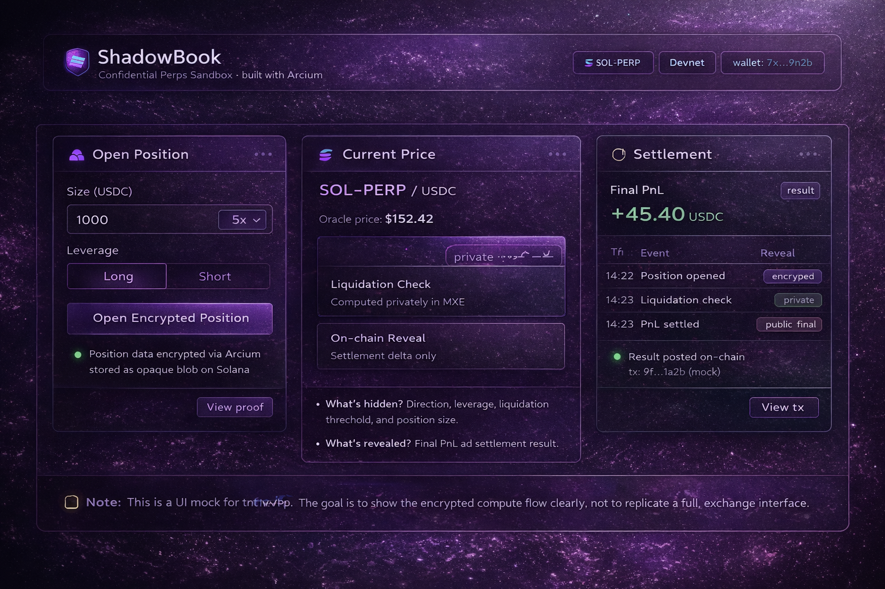

# ShadowBook (Solana + Arcium)
> A minimal experiment exploring how Arcium can reduce adversarial behavior in perpetual markets by hiding trader intent.
ShadowBook is a minimal perps sandbox built on Solana that explores how trader intent can remain private.

Traditional perpetual exchanges expose positions, liquidation prices, and order intent.  
This visibility enables copy-trading, targeted liquidations, and adversarial strategies.

ShadowBook experiments with a different model.

By integrating Arcium’s encrypted execution layer (MXE), liquidation checks and PnL calculations compute privately.  
Only final settlement outcomes are revealed on-chain.

This repository represents a learning-driven prototype, not a production exchange.

---

## 🧠 The Problem

Perpetual markets leak intent:

- Position direction (Long / Short)
- Position size
- Leverage
- Liquidation price

This transparency enables:

- Copy-trading
- Liquidation hunting
- Adversarial market behavior
- Strategic front-running

While transparency benefits settlement, it also introduces structural risk.

---

## 🔐 The Idea

Instead of exposing trader intent publicly:

- Position data is encrypted
- Liquidation checks compute privately
- PnL calculation happens inside Arcium
- Only final results are revealed

The goal is not to hide settlement.

The goal is to reduce adversarial behavior caused by intent exposure.

---

## 🏗 Architecture Overview

ShadowBook consists of two layers:

### 1️⃣ Public Layer (Solana Program)
- Market configuration
- Settlement accounts
- Encrypted position storage (no readable intent)
- Final PnL settlement

### 2️⃣ Confidential Layer (Arcium MXE)
- Encrypted position structure
- Private liquidation check logic
- Private PnL computation
- Minimal output (settlement delta only)

Arcium handles encrypted compute.  
Solana handles settlement and state anchoring.

---

## 🧩 Code Skeleton Status

This repo currently includes minimal code skeletons to show where:

- Encrypted position data is stored on Solana (`programs/perps_public/`)
- Liquidation checks and PnL compute privately in Arcium MXE (`programs/perps_confidential/`)

These are placeholders to clarify structure before full integration.

---

## 🔄 Execution Flow

1. User opens a position (client encrypts input).
2. Encrypted position data is stored.
3. Arcium MXE computes liquidation conditions privately.
4. Arcium computes PnL privately.
5. Only final settlement is posted on-chain.

At no point is liquidation price or position intent publicly revealed.

---

## 🧪 MVP Scope

This is a simplified sandbox including:

- Single SOL-PERP market
- Mock price oracle
- Encrypted position input
- Private liquidation check
- Final PnL settlement output

It is intentionally minimal to demonstrate the structural difference.

---

## 🔍 Privacy Model

Encrypted:
- Position direction
- Size
- Leverage
- Liquidation thresholds

Revealed:
- Final PnL
- Settlement result

ShadowBook does not aim to remove transparency from settlement.
It aims to remove unnecessary exposure from execution.

---

## 📦 Repository Structure

---

## 🖥 Dashboard Mock

A simple UI mock is included at: `app/index.html`

---

## 🧪 Demo Flow

1. User opens a position (encrypted client-side).
2. Encrypted position data is stored on Solana.
3. Arcium MXE performs private liquidation checks.
4. Arcium computes PnL privately.
5. Only final settlement delta is revealed on-chain.

This demonstrates how trader intent can remain hidden while preserving transparent settlement.

---

## 🌍 Potential Impact

Traditional perps transparency can unintentionally enable adversarial strategies.

By moving liquidation checks and PnL computation into Arcium’s encrypted execution layer, ShadowBook explores:

- Reduced targeted liquidation risk  
- Lower copy-trading surface  
- Cleaner liquidity behavior  
- Intent-hidden trading environments  

This prototype is an exploration of what confidential execution could mean for on-chain derivatives.
